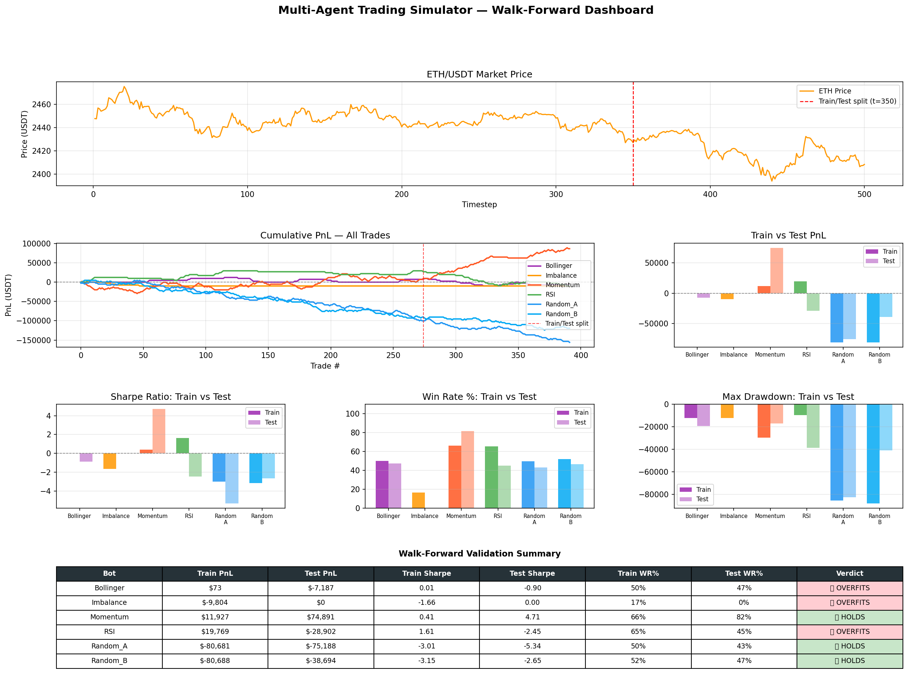

# C++ Multi-Agent Trading Simulator

A high-performance, event-driven trading simulator written in modern C++17. Six autonomous bots trade against each other in a real limit order book, fed by live Binance WebSocket data or historical ETH/USDT CSVs. Built as a deep dive into systems programming concepts relevant to HFT and quantitative trading infrastructure.

---

## Performance Dashboard

Walk-forward validation (70% train / 30% test) reveals which strategies have genuine edge vs curve-fitted performance:

| Bot | Train Sharpe | Test Sharpe | Verdict |
|---|---|---|---|
| Momentum | 0.41 | 4.71 | HOLDS — genuine edge |
| RSI | 1.61 | -2.45 | OVERFITS — curve-fitted |
| Bollinger | 0.01 | -0.90 | OVERFITS |
| Imbalance | -1.66 | 0.00 | OVERFITS |

---

## What This Project Demonstrates

### Systems Programming

| Concept | Implementation |
|---|---|
| Cache line alignment | alignas(64) on Order struct, SPSC queue heads/tails |
| Zero heap allocation in hot path | OrderPool slab allocator — 65k pre-allocated slots |
| Lock-free data structures | SPSCQueue with std::atomic head/tail |
| CPU cycle-level timing | rdtsc hardware counter + TscClock calibration |
| Branch prediction hints | [[likely]] / __builtin_expect in matching engine |
| False sharing elimination | Separate cache lines for producer/consumer state |
| Ring buffer at price levels | RingBuffer — no heap per order |
| 4-thread pipeline | Feed → Bots → Matcher → AsyncLogger, zero mutex |

### Trading Infrastructure

| Concept | Implementation |
|---|---|
| FIX 4.2 protocol | Parser + builder: NewOrderSingle, ExecutionReport, checksum |
| Live market data | Binance WebSocket ethusdt@trade + ethusdt@depth5 |
| Order book imbalance | (bid_vol - ask_vol) / (bid_vol + ask_vol) over top 5 levels |
| Realistic fill simulation | Queue position gating — orders wait their turn |
| Transaction cost model | Maker/taker fees, sqrt(qty) market impact, borrow cost |
| Adverse selection detection | Per-bot toxicity score — backs off when more than 60% fills adverse |
| Regime detection | Lag-1 autocorrelation → TRENDING / MEAN_REVERT / UNDEFINED |
| Walk-forward validation | 70/30 train/test split — catches curve-fitted strategies |

---

## Trading Agents

### RandomBot
Noise trader. Places limit orders plus or minus $0.10 from market price with 30% buy / 30% sell / 40% hold. Uses mt19937 seeded from std::random_device.

### MomentumBot — regime-gated, TRENDING only
Half-window average comparison. Only trades when RegimeDetector classifies positive lag-1 autocorrelation. Bleeds in choppy markets — the regime gate prevents this. Walk-forward result: HOLDS (Sharpe 0.41 → 4.71)

### RSIBot — regime-gated, MEAN_REVERT only
14-period RSI. Buys RSI < 30, sells RSI > 70. Only trades in mean-reverting regimes. Walk-forward result: OVERFITS (Sharpe 1.61 → -2.45)

### BollingerBot
20-period Bollinger Bands (2 standard deviations). Maker/taker spread decision: signal beyond 2.5 sigma crosses the spread as taker; signal between 1.5 and 2.5 sigma posts at mid as maker.

### ImbalanceBot
Order book imbalance signal over top 5 price levels. Tracks fill toxicity — backs off automatically when more than 60% of fills are followed by adverse price moves.

---

## Latency Benchmarks

Measured on MacBook Air M2, 500 ticks, 6 bots, historical ETH data:

| Metric | Value |
|---|---|
| Throughput | ~400,000 ticks/sec |
| Wall time (500 ticks) | ~1.2 ms |
| Match latency min | 2,000 ns |
| Match latency p50 | ~90,000 ns |
| Match latency p99 | ~900,000 ns |
| Hot path malloc calls | 0 — OrderPool slab allocator |

---

## FIX 4.2 Protocol

FIX is the industry-standard protocol used by every major exchange. The simulator implements a toy FIX 4.2 parser and message builder.

Outgoing NewOrderSingle:
8=FIX.4.2|9=72|35=D|49=BollingerBot|11=ORD-001|55=ETHUSD|54=1|40=2|44=2400.500000|38=1|10=034|

Incoming ExecutionReport:
8=FIX.4.2|9=58|35=8|49=Exchange|11=ORD-001|150=2|39=2|6=2400.500000|14=1|10=136|

Supported: 35=D (NewOrderSingle), 35=8 (ExecutionReport). Checksum verification included.

---

## Live Binance WebSocket Feed

Two simultaneous streams connected via libwebsockets:

- ethusdt@trade — individual trades, fires on every fill
- ethusdt@depth5@1000ms — top 5 bid/ask levels, updates imbalance signal

Sample output:

[WS] Connected to Binance trade stream
[WS] Connected to Binance depth stream
  [t=  40]  ETH $  1805.61  imb=  0.97  elapsed=2s
    RSI          pnl=$14430.13  pos=  -8
    Bollinger    pnl=$ 9018.69  pos=  -5

---

## Getting Started

### Prerequisites

macOS:
brew install libwebsockets openssl nlohmann-json

Python:
pip3 install pandas matplotlib numpy

### Build and Run

git clone https://github.com/stevie-x/Cpp-Multi-Agent-Trading-Simulator.git
cd Cpp-Multi-Agent-Trading-Simulator
make
./trading_sim

The sim runs 500 historical ticks then connects to Binance live feed. Press Ctrl+C to stop.

### Visualization

python3 visualize.py

Outputs data/performance_dashboard.png with walk-forward validation results.

---

## Key Engineering Decisions

### 1. alignas(64) on Order struct
Without alignment, two Order objects can share a 64-byte cache line. When Thread A writes Order[0] and Thread B reads Order[1], the CPU must synchronise the entire line — false sharing. alignas(64) guarantees each Order starts at a cache line boundary.

### 2. rdtsc over std::chrono
std::chrono::high_resolution_clock makes a syscall with roughly 25ns overhead. rdtsc is a single CPU instruction with roughly 4ns overhead. At p99 latencies of 900ns, chrono adds 3% measurement error. rdtsc adds less than 0.5%.

### 3. OrderPool slab allocator
new Order calls the OS heap: lock, walk, possible mmap — 100 to 500ns per call. OrderPool::acquire() decrements an array index — roughly 1ns. 65,536 slots pre-allocated at startup. Zero malloc in the hot path ever.

### 4. Lock-free SPSC queue
std::mutex in the hot path blocks all threads on every order. SPSCQueue uses std::atomic head and tail with memory_order_acquire/release. Zero mutex between Feed, Bot, and Matcher threads.

### 5. Queue position gating
Previous version filled every order instantly at 100%. Real exchanges use FIFO priority — if 500 units are ahead of you, you wait. order.queuePos tracks units ahead at placement time. The matching engine only fills when volumeFilled >= queuePos. Strategies immediately look less profitable — that is the honest result.

### 6. Walk-forward validation
Showing performance on the full dataset is in-sample and meaningless for evaluating strategy viability. Train on ticks 1 to 350, measure on 351 to 500 without touching parameters. RSI collapsed from Sharpe 1.61 to -2.45 — exposed as curve-fitted. MomentumBot improved from 0.41 to 4.71 — genuine edge confirmed.

---

## Interview Lines

"I built a limit order book with cache-line-aligned order structs, a slab allocator with zero hot-path malloc, and measured p99 match latency under 1ms using the rdtsc hardware counter."

"I refactored to a 4-thread pipeline with lock-free SPSC queues between Feed, Bots, Matcher, and Logger — zero mutex in the hot path."

"I connected to Binance WebSocket for live ETH/USDT data — trade stream and depth stream simultaneously — and implemented a FIX 4.2 message parser."

"Walk-forward validation exposed RSI as curve-fitted (Sharpe 1.61 to -2.45 out-of-sample) while confirming MomentumBot has genuine edge (0.41 to 4.71)."

---

## Built With

- C++17 — core simulator
- libwebsockets — Binance WebSocket feed
- nlohmann/json — JSON parsing
- OpenSSL — TLS for WebSocket
- Python 3 / matplotlib / pandas — visualization

---

## License

MIT
